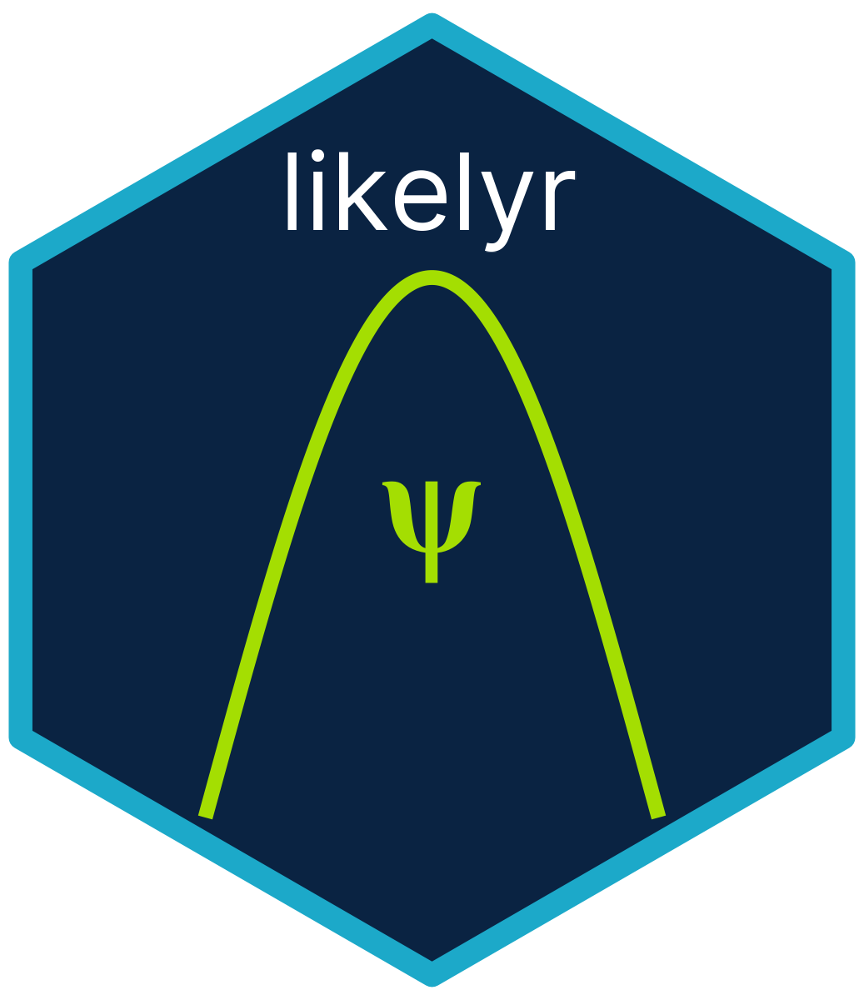

# likelyr 

**likelyr** is a modular R framework for computing **integrated likelihoods (IL)**
under a zero-score expectation (ZSE) parameterization for arbitrary statistical 
models and scalar parameters of interest.

It decouples the IL workflow into reusable pieces:

- **model specifications**
- $\psi$ **specifications** (parameter of interest)
- $\Omega_{\hat{\psi}}$ **sampling** (for implicit ZSE nuisance parameter)
- **expected log-likelihood construction**
- **nuisance-constrained optimization**
- **branch maximization and expansion**
- **branch averaging via log-sum-exp** (Monte Carlo approximation)
- **simulation tools to compare IL vs PL**

The goal is to make IL inference accessible, extensible, and reproducible.

## Installation

```r
# Development version
devtools::install_github("TimRuel/likelyr")
